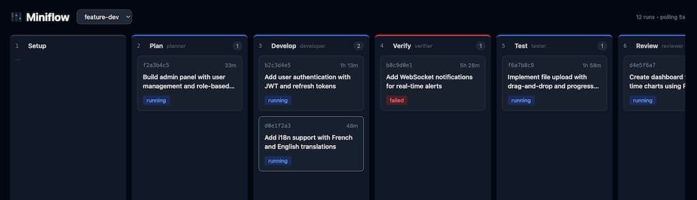

<p align="center">

# Agentfarm


</p>

**AI workflow orchestrator for OpenClaw, Claude CLI, OpenCode, Crush...**

```
agentfarm run "Add dark mode" --repo ./my-app
  ├─ setup       (script: git worktree + branch)
  ├─ planner     (AI: plan.json with user stories + agent assignment)
  ├─ developer   (AI: implements stories in a loop, specialist per story)
  ├─ verifier    (AI: checks code vs plan)
  ├─ tester      (AI: writes & runs tests)
  ├─ reviewer    (AI: final review)
  └─ merger      (AI: merge branch into main, cleanup worktree)
```

## Install

```bash
git clone https://github.com/Franckrst/Agentfarm.git
cd Agentfarm
npm install
npm run build
npm link  # makes 'agentfarm' available globally
agentfarm init  # configure provider and install skills
```

The `init` command will:
1. Ask you to select your AI provider (Claude Code, OpenClaw, OpenCode/Crush)
2. Set up the configuration
3. Automatically install skills to your provider's skills directory

**Requirements:** Node.js 18+, `git`, an AI CLI ([Claude Code](https://docs.anthropic.com/en/docs/claude-cli), [OpenClaw](https://github.com/openclaw/openclaw), or anything that runs a prompt file).

## Configure

Edit `config.json`:

```json
{
  "spawn_command": "claude --model \"$AGENTFARM_MODEL\" --prompt-file \"$AGENTFARM_TASK_FILE\"",
  "default_model": "claude-sonnet-4-20250514",
  "stuck_timeout_hours": 3
}
```

The pipeline exports these env vars before running `spawn_command`:

| Variable | Content |
|----------|---------|
| `$AGENTFARM_MODEL` | Model for this step |
| `$AGENTFARM_LABEL` | Unique session label |
| `$AGENTFARM_TASK_FILE` | Path to the prompt file |
| `$AGENTFARM_PROMPT` | Prompt content (file already read) |
| `$AGENTFARM_DIR` | Agentfarm install directory |
| `$AGENTFARM_RUN_ID` | Current run ID |
| `$AGENTFARM_RUN_DIR` | Current run directory |

See **Setup by Provider** below for provider-specific configs.

| Field | Description |
|-------|-------------|
| `spawn_command` | How to launch an AI agent (**required**) |
| `notify_command` | Send notifications (`{message}` placeholder) |
| `default_model` | Fallback model for steps without explicit `model` |
| `stuck_timeout_hours` | When to consider a step stuck (default: 2) |
| `session_check_command` | Check if agent is still alive (`{label}` placeholder) — medic skips active sessions |

## Usage

```bash
agentfarm run "Add auth" --repo ./project              # start
agentfarm run "Fix bug" --repo ./project --workflow bug-fix  # different workflow
agentfarm status                                        # latest run
agentfarm list                                          # all runs
agentfarm cancel <run-id>                               # abort
agentfarm logs <run-id>                                 # step outputs
```

## Setup by Provider

All providers are configured automatically via `agentfarm init`. The sections below are for manual setup or reference.

### Claude Code

Skills are installed automatically to `~/.claude/skills/agentfarm`.

Manual setup (if needed):
```bash
cp templates/config.claude.json ~/.agentfarm/config.json
```

### OpenClaw

Skills are installed automatically to `~/.openclaw/skills/agentfarm`.

Manual setup (if needed):
```bash
cp templates/config.openclaw.json ~/.agentfarm/config.json
```

Set up the medic cron (hourly stuck check):
```bash
# system crontab
0 * * * * cd /path/to/agentfarm && node dist/pipeline/unstick.js --auto >> /var/log/agentfarm-medic.log 2>&1
```

That's it. Your OpenClaw agent can now run `agentfarm run` directly.

### OpenCode / Crush

[OpenCode](https://github.com/opencode-ai/opencode) (now [Crush](https://github.com/charmbracelet/crush)) is a TUI — no headless/non-interactive mode yet. Workaround: pipe the prompt via stdin.

Skills are installed automatically to `~/.crush/skills/agentfarm`.

Manual setup (if needed):
```bash
cp templates/config.opencode.json ~/.agentfarm/config.json
```

> ⚠️ Experimental — Crush's non-interactive support may be limited. Check their docs for updates.

## The Contract

Your spawned agent must do **one thing**: execute the task in `{task_file}`.

The pipeline handles the rest — it waits for the agent to finish, checks the exit code, and moves to the next step. Provider-agnostic — works with any CLI that can run a prompt.

## Workflows

JSON files in `workflows/`. Each defines a pipeline:

```json
{
  "name": "feature-dev",
  "steps": [
    {"id": "plan",    "type": "ai", "role": "planner"},
    {"id": "develop", "type": "ai", "role": "developer", "loop": true},
    {"id": "verify",  "type": "ai", "role": "verifier"},
    {"id": "test",    "type": "ai", "role": "tester"},
    {"id": "review",  "type": "ai", "role": "reviewer"},
    {"id": "merge",   "type": "ai", "role": "merger"}
  ]
}
```

- **`type: script`** — runs a script (setup is handled automatically by `agentfarm run`)
- **`type: ai`** — spawns an agent with `prompts/<role>.md`
- **`model`** — per-step override (falls back to `default_model`)
- **`loop: true`** — iterates over stories from `plan.json` (sequential)

Create **custom workflows**: add a JSON in `workflows/`, create matching `prompts/<role>.md` files, run.

## Agent Specialization

Define specialist agents in `agents.json`:

```json
{
  "agents": [
    { "name": "expert-frontend", "description": "React, CSS, UI components", "file": "agents/expert-frontend.md" },
    { "name": "expert-backend",  "description": "APIs, auth, business logic",  "file": "agents/expert-backend.md" },
    { "name": "expert-database", "description": "SQL, migrations, schemas",    "file": "agents/expert-database.md" },
    { "name": "expert-fullstack","description": "End-to-end integration",      "file": "agents/expert-fullstack.md" }
  ]
}
```

The **planner** sees the list and assigns the best agent per story in `plan.json`:

```json
{ "id": "US-001", "title": "Create API", "status": "pending", "agent": "expert-backend" }
```

During the **develop** loop, the agent's `.md` profile is injected into the developer prompt — giving each story a specialist context. If no agent is assigned, the developer acts as a generalist.

Add your own agents: create a `.md` file in `agents/`, add an entry to `agents.json`.

## Prompts

Templates in `prompts/` with placeholders:

| Placeholder | Replaced by | Description |
|-------------|-------------|-------------|
| `{task}` | `build_prompt()` | Task description (or story override in loop) |
| `{repo}` | `build_prompt()` | Git worktree path (where agents work) |
| `{repo_origin}` | `build_prompt()` | Original repository path |
| `{branch}` | `build_prompt()` | Feature branch name |
| `{run_id}` | `build_prompt()` | Current run ID |
| `{run_dir}` | `build_prompt()` | Run directory path |
| `{agentfarm_dir}` | `build_prompt()` | Agentfarm install directory |
| `{plan}` | `build_prompt()` | Full plan.json content |
| `{agents}` | `build_prompt()` | Formatted agent list from agents.json |
| `{agent_prompt}` | `build_prompt()` | Specialist profile content (or empty) |

## Medic (auto-recovery)

```bash
node dist/pipeline/unstick.js --auto          # detect & fix all stuck steps
node dist/pipeline/unstick.js <run-id> <step> # fix a specific step
```

AI medic reads context (plan, git log, artifacts), checks if the agent is still alive, then chooses: **complete** / **resume** / **retry** / **fail**.

Schedule it hourly via cron, systemd timer, or OpenClaw cron.

## Dashboard

```bash
agentfarm dashboard   # start
agentfarm stop        # stop
```

Kanban board with real-time polling, step progress badges, dark mode.

## Project Structure

```
src/           TypeScript source (CLI, commands, pipeline engine)
dist/          Compiled JavaScript (auto-generated)
bin/           CLI entry point
workflows/     Pipeline definitions (JSON)
prompts/       Agent prompt templates (Markdown)
agents/        Specialist agent profiles (Markdown)
agents.json    Agent registry (name, description, file)
templates/     Provider config templates
runs/          Runtime data (auto-created, gitignored)
ui/            Dashboard (React + Express, logs viewer)
config.json    Your config (gitignored)
```

Each run creates a git worktree at `<repo>/.worktrees/<run_id>/` so the original repo stays untouched on its current branch. The merger step merges back into main and cleans up the worktree.

## License

MIT
